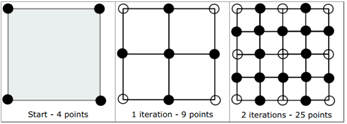

<h3 align="center"> 
    📢 softeer(지도 자동 구축) : https://softeer.ai/practice/info.do?idx=1&eid=413&sw_prbl_sbms_sn=201645
</h3>

 

## 🚀 문제
현대자동차그룹이 레벨3 자율주행차 상용화 목표에 발맞춰 총력을 다하고 있는 가운데, 국내 최고 수준의 지도 구축 기술력을 보유한 현대엠엔소프트는 자율주행에 필요한 정밀지도를 제작해 배포하고, 기술 고도화를 위한 연구에 매진하고 있다.

최근에는 도로 데이터를 기반으로 자동으로 정밀지도를 구축하는 ‘지도 자동 구축(Map Auto Creation, 이하 MAC)’ 기술을 개발해 지도 제작 시간을 단축하고 정밀도를 향상시키는 데 성공했다.

자율주행차용 정밀 지도에 관한 궁금증으로 인터넷 검색을 해보니, Diamond-Square-Algorithm이라는 것을 찾게 되었다. 이 알고리즘은 정사각형을 이루는 점 4개를 고르고 그 후에는 다음과 같은 과정을 거쳐 모양이 만들어진다.

정사각형의 각 변의 중앙에 점을 하나 추가한다.

정사각형의 중심에 점을 하나 추가한다.

---
## 🚦제한사항
- 1 ≤ N ≤ 15

---

## ⌨️ 입출력예
입력 형식 : 첫째 줄에 N이 주어진다.
1

출력 : 첫째 줄에 N단계를 거친 점의 개수를 출력한다.
9

---

### 📜 기능 목록
- [x] dp를 이용하여 피포나치 수열을 구현
